# OTT 시청 로그 실시간 세션화 & 장애 대응 파이프라인

## 1. 프로젝트 목표

OTT(넷플릭스, 왓챠 등) 서비스의 시청 이벤트를 실시간으로 수집하고, 유저 단위 시청 세션으로 묶어서 소비 트렌드(장르별 인기도, 완주율 등)를 집계한다. 여기서 그치지 않고 파이프라인을 의도적으로 고장 내보면서, 장애 상황에서도 데이터 유실 없이 복구되는 구조인지를 직접 검증하는 것까지를 목표로 한다.

**왜 이 문제를 골랐는지**: 대부분의 데이터 파이프라인 프로젝트는 "정상 동작"까지만 만들고 끝나는데, 실제 현업에서는 "장애가 났을 때 어떻게 되는가"가 더 중요한 경우가 많다고 생각하기 때문이다. 이번 프로젝트는 정상 케이스뿐 아니라 장애 케이스까지 직접 재현하고 대응 과정을 기록하려고 한다.

---
### 상세 문서 및 아키텍처
데이터 파이프라인의 상세 구조와 아키텍처 다이어그램은 아래 문서에서 확인하실 수 있습니다.
**[파이프라인 상세 안내 (PIPELINE_README.md)](./PIPELINE_README.md)**

### 4주차 제출물 (Kafka 이벤트 스트리밍 & Spark 배치 전처리)
- **[데이터·메시지 명세 (DATA_MESSAGE_SPEC.md)](./DATA_MESSAGE_SPEC.md)** — 필드명/타입/의미, Kafka JSON 예시, Topic 이름
- **[Kafka/Spark 실행 결과 및 실제 구현 vs 계획 (kafka_spark.md)](./kafka_spark.md)** — 실행 명령, 처리 전후 건수, 최종 저장 위치/형식

## 2. 사용할 데이터셋과 출처

### 2-1. MovieLens

| 파일 | 용도 |
|---|---|
| `ratings.csv` | userId, movieId, rating, timestamp — 이벤트 생성기의 시드 데이터 |
| `movies.csv` | movieId, title, genres — 기본 메타데이터 |
| `links.csv` | movieId ↔ imdbId ↔ tmdbId 매핑 — TMDB API 조회에 사용 |

두 가지 버전을 단계별로 사용한다.

| 버전 | 규모 | 사용 시점 | 용도 |
|---|---|---|---|
| ml-latest-small | 평점 약 10만 건, 영화 약 9,700편 | 개발 단계 | 빠른 개발/디버깅 사이클 |
| ml-25m | 평점 약 2,500만 건, 영화 약 62,000편 | 로드 테스트/장애 대응 | 지속적인 부하를 만들어내는 소스 데이터 |

출처: https://grouplens.org/datasets/movielens/

### 2-2. TMDB API

영화 메타데이터(장르, 개봉일, 러닝타임, 포스터 등)를 보강하기 위해서 사용한다. `links.csv`의 tmdbId로 조회한다.

- 문서: https://developer.themoviedb.org/docs/getting-started
- 개인/비상업(Developer) 등급으로 신청 후 무료 사용
- API 키는 `.env` 파일로 관리하고 `.gitignore`로 제외 (레포에 노출되지 않음)

### 2-3. 자체 이벤트 생성기

MovieLens는 "유저가 영화에 평점을 남겼다"는 정적 스냅샷이지, "재생했다가 스킵했다" 같은 세분화된 시청 행동 로그가 아니다. 따라서 평점 타임스탬프를 기준점으로 삼아서, 그 전후로 아래와 같은 이벤트를 생성한다.

- `play`, `pause`, `seek`, `complete`, `drop` 이벤트를 순서대로 생성
- 시청 지속시간: 로그정규분포 (대부분 짧게 이탈, 소수는 끝까지 시청하는 패턴 반영)
- 콘텐츠 인기 쏠림: 파레토 분포 (소수 인기작에 시청 이벤트가 몰리는 실제 서비스 패턴 반영)

**선정 이유**: 완전히 무작위로 합성한 가짜 데이터보다, 실제 사용자 행동 통계(MovieLens)를 기반으로 시드를 삼는 편이 더 현실적인 로그를 만든다. 다만 세밀한 스트리밍 이벤트는 원본에 없으므로 이 부분만 직접 생성기로 채워 넣는다.

## 3. 수집 → 처리 → 저장 흐름

```
[MovieLens CSV] ──(1회 로드)──▶ [PostgreSQL: 영화 메타 테이블 (+ TMDB 보강)]
                                            
[이벤트 생성기 (Python)]                    
  MovieLens 타임스탬프를 시드로             
  play/pause/seek/complete 이벤트 생성      
       │                                    
       ▼                                    
  [Kafka Topic: viewing-events]             
  (JSON, user_id 기준 파티셔닝)             
       │                                    
       ▼                                    
  [Spark Structured Streaming]              
  - session_window(30분) 기반 세션화        
    (user_id, movie_id별 그룹화, watermark  
     10분으로 late data 처리)               
  - dropDuplicates(event_id)로 동일 이벤트  
    재전송 방지                             
       │                                    
       ▼                                    
  [PostgreSQL: sessions 테이블] (session_id는 xxhash64 해시, upsert 저장)
       │
       ▼
  [Airflow DAG] — 일 배치로 랭킹/지표 재계산, retry/backoff, 품질 체크
       │
       ▼
  [장애 주입 실험]
  1) Kafka 브로커 재시작 중 Producer/Consumer 동작 확인
  2) Spark 스트리밍 잡 강제 종료 → 체크포인트 기반 재시작 시
     중복/유실 여부 검증
  3) Consumer 처리 속도 < Producer 발행 속도일 때
     consumer lag 관찰 및 대응
  → 결과를 "시나리오 → 발생 문제 → 대응 → 결과" 표로 README에 기록
```

### 3-1. Kafka 설계

- 토픽: `viewing-events` 단일 토픽
- 파티셔닝: `user_id` 기준 → 같은 유저의 이벤트 순서 보장 (세션화 정합성을 위해 필수)
- 파티션 수: 초기값으로 시작, 로드 테스트 결과 보고 조정
- 리텐션: 로컬 개발 기준 짧게 설정 (예: 1일), 이후 필요시 조정

### 3-2. Spark 처리 설계

- Kafka Consumer로 이벤트를 읽어 파싱
- **(계획 대비 변경)** 당초 `mapGroupsWithState`로 커스텀 상태 관리를 계획했으나,
  구현 단계에서 Spark 내장 `session_window(event_time, "1800 seconds")`로
  대체했다. `(user_id, movie_id)` 기준으로 그룹화하면 동일한 결과(30분
  무활동 시 세션 분리)를 더 적은 코드로, 직접 상태를 관리하는 부담 없이
  얻을 수 있어서 커스텀 state 관리보다 이 방식을 택했다.
- 세션 종료 조건: 마지막 이벤트 이후 30분(`SESSION_TIMEOUT_SEC=1800`) 무활동
- watermark: 10분(`WATERMARK_DELAY`)으로 확정. late data(네트워크 지연 등으로
  늦게 도착하는 이벤트)를 이 범위까지는 같은 세션으로 인정하고, 그 이후 도착분은
  버린다.
- `dropDuplicates(["event_id"])`: watermark 범위 내에서 동일 `event_id`가
  중복 도착하면 제거 — producer 재시도나 실수로 같은 데이터를 재전송해도
  세션 집계가 부풀지 않도록 하는 안전장치. (E) 장애 실험(8-4)에서 실제로
  검증됨.
- 세션 식별자(`session_id`)는 원본 문자열 세션ID(`u{user}-m{movie}-s{n}`)를
  `xxhash64`로 해시한 BIGINT — 재시작/재처리 후에도 같은 세션이 항상 같은
  키로 매핑되어야 PostgreSQL upsert가 "새 행 추가"가 아니라 "기존 행 갱신"으로
  동작하기 때문
- 세션 집계 시 원본 이벤트의 `genre` 값을 `genre_list`(text[])로 저장 (현재는
  이벤트 자체에 이미 포함된 대표 장르 1개만 담는 형태이며, 영화 메타 테이블과의
  실제 JOIN 보강은 아직 붙이지 않음 — 8-7 참고)

### 3-3. 저장 설계

- PostgreSQL 단일 사용
- 이유: 원본 이벤트 전체가 아니라 Spark가 집계한 세션 단위 결과만 저장하므로, 대용량 분산 저장(Parquet 등)보다는 관계형 구조(세션-영화-장르 조인)에 적합한 PostgreSQL이 더 알맞다고 판단
- **확정 스키마** (`sql/init_schema.sql`):

  | 컬럼 | 타입 | 설명 |
  |---|---|---|
  | `session_id` | `bigint` (PK) | 원본 문자열 세션ID의 `xxhash64` 해시 |
  | `user_id` / `movie_id` | `integer` | |
  | `start_ts` / `end_ts` | `timestamptz` | 세션 시작/종료 시각 |
  | `event_count` | `integer` | 세션 내 이벤트 수 |
  | `completed` | `boolean` | `session_end` 이벤트 존재 여부로 판정 |
  | `completion_rate` | `numeric(4,3)` | `max_position_sec / duration_sec` |
  | `genre_list` | `text[]` | 대표 장르 |
  | `ingested_at` | `timestamptz` | upsert 시각 (기본값 `now()`) |

  인덱스: `session_id`(PK), `movie_id`, `start_ts`, `user_id`

### 3-4. Airflow 설계

- 일 배치로 전일 랭킹/리텐션 지표 재계산
- retry/backoff: 지수 백오프, 최대 재시도 횟수 설정
- 데이터 품질 체크: 집계 건수 이상 감지, null 체크 등

## 4. 사용해보고 싶은 기술 후보 (확정 아님)

| 컴포넌트 | 후보 | 선정 이유 |
|---|---|---|
| 데이터 수집 | Kafka (local) | Producer/Consumer 디커플링, 장애 시 디스크 기반 재처리 가능 |
| 가공/집계 | Spark Structured Streaming | 세션화(session_window), 윈도우 집계가 복잡해 Pandas보다 적합 |
| 워크플로우 관리 | Airflow (local) | 일 배치 재계산 + retry/backoff 실습, cron 대비 의존성 관리와 모니터링이 용이 |
| 저장소 | PostgreSQL | 집계 결과가 관계형 구조(세션-영화-장르)라 JOIN이 잦음 |
| API 서빙 (선택) | FastAPI | 세션 기반 집계 결과 조회 엔드포인트 |
| 시각화 (선택) | Streamlit | 장르별/시간대별 트렌드 대시보드 |
| 컨테이너화 | Docker Compose | 전체 스택을 로컬에서 재현 가능하게 구성 |

**아직 결정하지 않은 세팅**

- 세션 타임아웃 기준(30분)과 watermark 지연 허용 범위 → 실험 후 확정
- Kafka 파티션 수 → 로드 테스트 결과를 보고 조정
- 완주율(completion rate) 정의 → 러닝타임 대비 시청 비율로 잠정 설정, 세부 기준은 스키마 설계 시 확정
- 이상탐지, CDC 기반 메타데이터 동기화, 추천 모델 연동 → 시간 여유 시 후속 확장으로 검토


## 5. 데이터 준비 방법

```
data/
└── raw/
    ├── ml-latest-small/     # 레포에 포함 (개발용, 용량 작음)
    │   ├── movies.csv
    │   ├── links.csv
    │   └── ratings.csv
    └── ml-25m/               # 레포에 미포함 (용량 문제, 로드 테스트용)
```

`ml-25m`은 용량 문제로 레포에 포함하지 않았습니다. 아래 링크에서 직접 다운받아 `data/raw/ml-25m/` 경로에 압축한 뒤 사용할 예정이다.
https://grouplens.org/datasets/movielens/25m/

## 6. Airflow DAG 파라미터화

지금까지 만든 수집(`backfill_ingest.py`)·처리(`spark_batch_preprocess.py`)
코드를 Airflow DAG(`dags/backfill_ingest_process_dag.py`)로 연결하고,
코드를 고치지 않고도 값을 바꿔 재실행할 수 있도록 파라미터화했다.

### 파라미터 설계

주식 데이터의 `ticker`에 해당하는 축으로, 이 프로젝트에서는 아래 4개를
Airflow `Param`으로 받는다.

| 파라미터 | 의미 |
|---|---|
| `start_date` / `end_date` | 수집·처리할 기간 |
| `genre` | 선택, 특정 장르만 필터링 (비우면 전체) |
| `source_path` | 선택, 다른 입력 CSV로 교체 (비우면 기본 샘플 사용) |

### DAG 구조 (4단계)

1. `extract_window` — source_path 원본을 청크 단위로 스캔하며 날짜/장르
   조건에 맞는 행만 필터링 (대용량 원본에서도 메모리 부담을 낮추기 위해
   전체를 한 번에 메모리에 올리지 않음)
2. `ingest_events` — `backfill_ingest.py`로 필터링된 구간을 PostgreSQL에
   적재. 같은 조건(`backfill_tag`)으로 재실행해도 중복이 쌓이지 않도록
   해시 기반 멱등성 처리
3. `spark_process` — `spark_batch_preprocess.py`(Spark)로 세션 단위 집계
4. `quality_check` — 처리 건수가 0건이면 실패 처리

### 재실행 검증

같은 코드로 조건만 바꿔 두 차례 실행했다.

| 조건 | 결과 |
|---|---|
| 전체 기간, 장르 전체 | 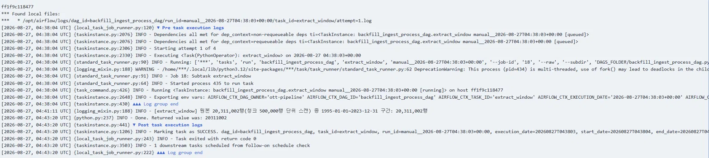 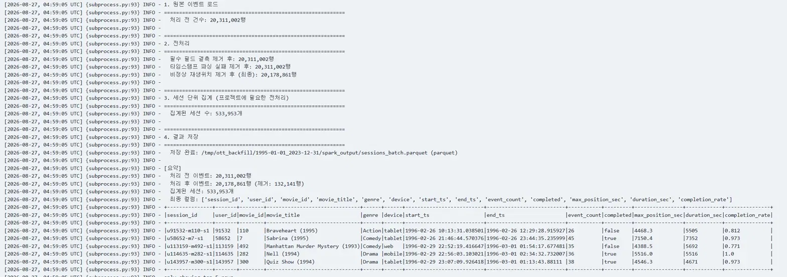 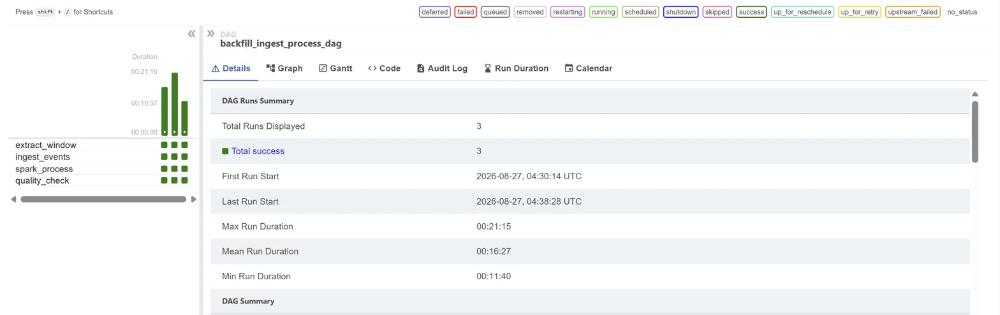 |
| `2000-01-01 ~ 2023-12-31`, `genre=Comedy` | 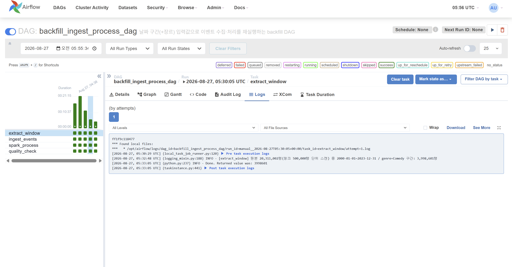 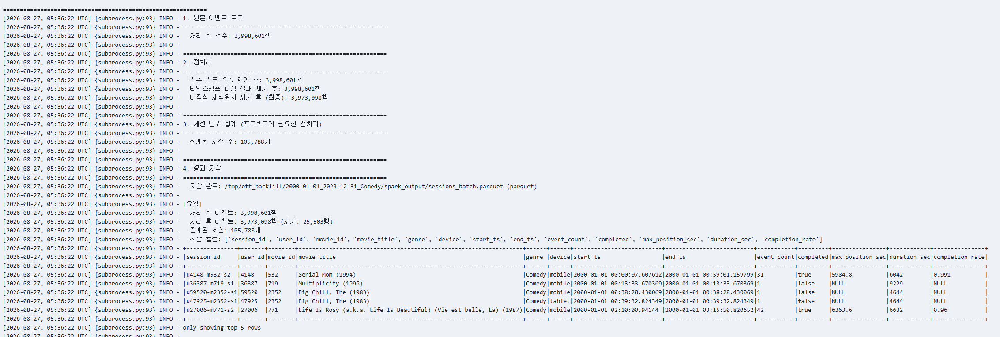 |
| `2010-01-01 ~ 2023-12-31`, `genre=Action` | 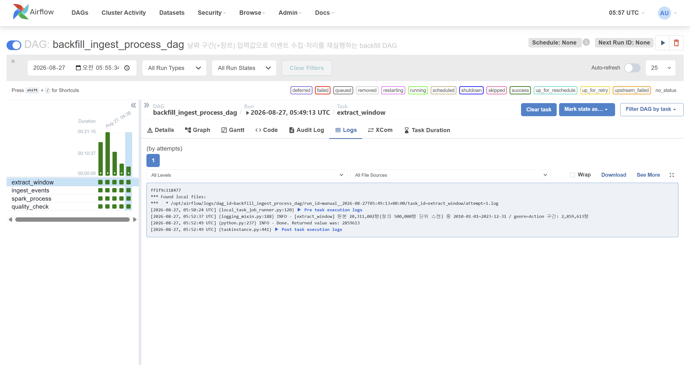 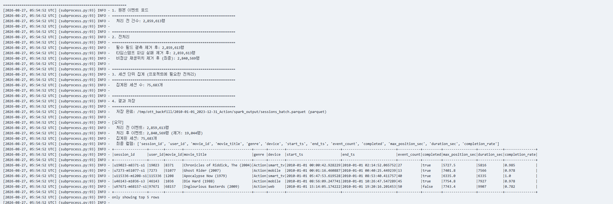 |

세 실행 모두 코드 수정 없이 Trigger 시 파라미터 값만 바꿔서 실행했고,
4개 태스크(`extract_window → ingest_events → spark_process →
quality_check`) 전부 성공했다.

### 대용량(ml-25m) 처리 안정화

`source_path`에 MovieLens ml-25m(평점 2,500만 건) 기반으로 생성한
약 2,000만 건 규모 이벤트 데이터를 지정해 실제로 재실행하면서, 다음
문제를 발견하고 고쳤다.

- `load_reference_data.py`: 평점 데이터를 건별 INSERT하던 방식은
  2,500만 건 규모에서 사실상 멈춰서, PostgreSQL COPY 기반 대량 적재로
  변경 (2,500만 행 약 250초에 적재)
- `ingest_v2_events.py`: 여러 청크로 나눠 생성 시 같은 영화의 같은 구간이
  청크마다 중복 집계되는 문제가 있어, 병합·재집계 로직 추가
- `extract_window`: 원본 전체를 메모리에 올리던 방식을 청크 단위 스캔으로
  변경

### fallback(retry) 실제 동작 확인

`default_args`에 설정한 `retries=3`(지수 백오프)이 실제로 발동한 사례가
있다. 대용량(ml-25m) 처리 안정화 과정에서 `spark_process` 태스크가:

1. 1차 시도: `--input-format` 인자 누락으로 argparse 실패 → `up_for_retry`
2. 2차 시도(자동 재시도): `JAVA_HOME` 미설정으로 실패 → `up_for_retry`
3. 3차 시도(자동 재시도): 코드 수정 반영 후 성공

순서로 Grid 뷰에서 빨강→노랑→초록으로 표시되는 것을 실제로 관찰했다
(스크린샷은 6주차 `airflow_screenshots/` 참고). 코드 버그로 인한 실패였지만,
**Airflow의 자동 재시도 자체는 설계대로 정확히 3회까지 동작함**을 확인한
사례다.

`quality_check` 태스크는 `window_count == 0`이면 `AirflowFailException`을
던지도록 설계된 일종의 alert(품질 게이트)인데, 지금까지의 실행에서는
조건에 맞는 데이터가 항상 존재해 **실제로 트리거된 적은 없다** —
검증되지 않은 상태로 남아있는 부분이다 (8-7 참고).

### 완료됨: 실시간 스트리밍 및 장애 주입 실험

장애 주입 실험(Kafka 브로커 다운, Spark 강제 종료 후 체크포인트 복구,
DB 적재 실패, 동일 이벤트 중복 전송, 잘못된 입력)과 실시간 스트리밍
(`spark_session_pipeline.py`)은 7주차(8장)에서 완료했다. 아래는 그 결과다.

## 7. 향후 확장 계획

현재는 단일 플랫폼(가상의 OTT 하나)을 가정한 이벤트 스키마로 설계되어 있다.
실제 서비스 환경에서는 넷플릭스, 왓챠, 티빙처럼 플랫폼마다 이벤트 필드명,
타임스탬프 단위(초 vs 밀리초), 세션 정의(무활동 기준 시간 등)가 다르다.

- **정규화 계층(Normalization Layer)**: 플랫폼별 원본 스키마를 표준 스키마로
  변환하는 어댑터. Kafka Producer 이전 단계 또는 Spark 초입에 위치시키는 것을
  고려 중이다.
- **스키마 레지스트리**: 플랫폼이 늘어날수록 스키마 버전 관리가 필요해지므로,
  Avro + Schema Registry 도입을 검토할 수 있다.
- **장애 복구 범위 확장**: 정규화 계층 자체의 장애(예: 알 수 없는 플랫폼
  스키마가 들어왔을 때)까지 포함해 장애 시나리오를 확장한다.

이번 프로젝트 범위에서는 단일 플랫폼 기준으로 세션화와 장애 대응을 먼저
완성도 있게 구현하고, 위 확장은 시간 여유가 있을 경우 다음 단계로 진행할 예정이다.

## 8. 실시간 스트리밍 파이프라인 부하 테스트 및 장애 5종 재현

이전까지는 Airflow 배치 파이프라인을 파라미터화하고 대용량(ml-25m 기반
2,000만 건) 처리 안정화에 집중했다면, 이번에는 진행 중이던 실시간 스트리밍
파이프라인(`spark_session_pipeline.py`, Kafka → Spark Structured Streaming
→ PostgreSQL)을 실제로 붙여서 ① 대용량 부하를 견디는지, ② 장애 상황
5가지에서 어떻게 동작하는지를 직접 재현하고 기록했다.

### 8-1. 사전 준비 (매 새 터미널)

```powershell
cd "C:\Users\User\Desktop\ott-pipeline-clean"
.venv311\Scripts\activate
```

- **producer 터미널**: `kafka_producer.py`로 CSV를 Kafka `viewing-events`
  토픽에 전송
- **스트리밍 터미널**: `spark-submit`으로 `spark_session_pipeline.py` 실행
  (Kafka 컨슘 → `session_window` 세션화 → PostgreSQL upsert, 상세 설계는
  3-2 참고)
- **쿼리 터미널**: `docker exec`로 PostgreSQL 조회/기록

```powershell
set PYSPARK_PYTHON=%VIRTUAL_ENV%\Scripts\python.exe
spark-submit --packages org.apache.spark:spark-sql-kafka-0-10_2.12:3.5.1 pipeline\spark_session_pipeline.py
```

### 8-2. 0단계 — 기준선(baseline) 기록

원본 샘플(`kafka_sample_2000.csv`, 1,910건)을 rate=500/s로 전송.

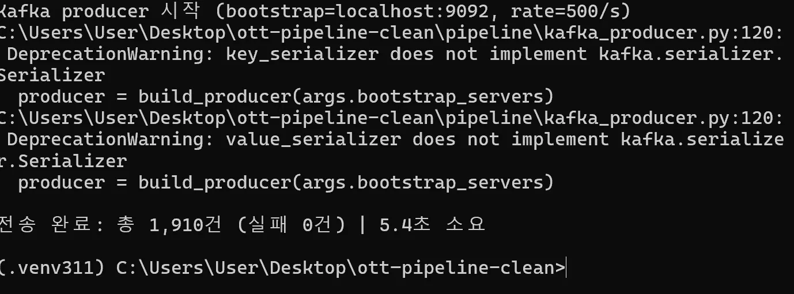
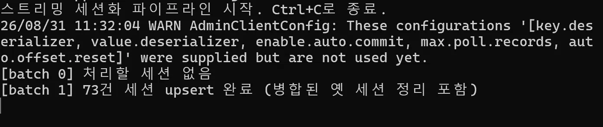

전송 완료(1,910건, 5.4초) 후 세션화 결과:

| sessions | total_events |
|---|---|
| 73 | 1909 |

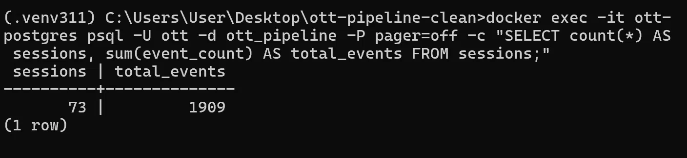

```sql
INSERT INTO failure_experiments (scenario, started_at, ended_at, notes)
VALUES ('baseline', now(), now(), '1910건 기준선: 73개 세션 upsert')
RETURNING experiment_id;
```

### 8-3. 1단계 — 대용량 실행 (500만 건)

`bootstrap_sample.py`로 원본 1,910건을 부트스트랩 샘플링하여 500만 건
CSV(`kafka_sample_bootstrap_5m.csv`)를 생성한 뒤, `sessions` 테이블을
TRUNCATE하고 rate 제한 없이(`--rate 0`) 전송했다.

```
전송 완료: 총 5,000,000건 (실패 0건) | 3365.5초 소요 (약 56분)
```

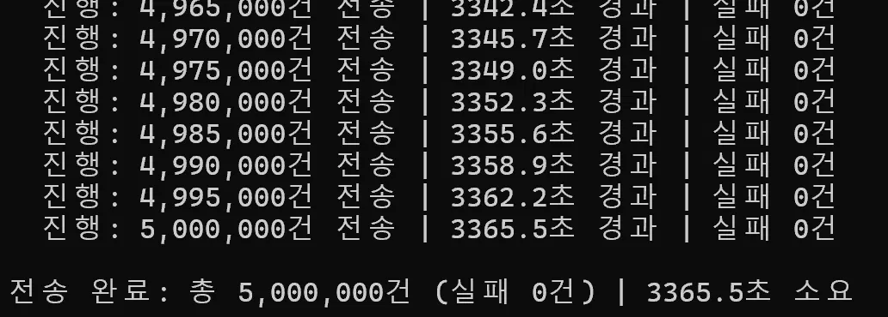

전송 후 워터마크 처리 대기(2~3분) 후 세션화 결과:

| sessions | total_events |
|---|---|
| 66,156 | 1,707,541 |

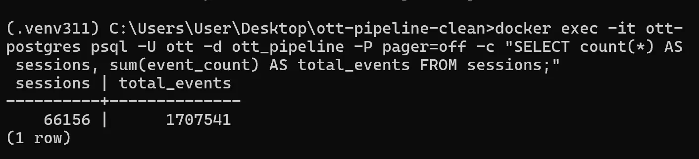

500만 건 규모에서도 producer 전송 실패 0건, 스트리밍 세션화까지 크래시
없이 완주하는 것을 확인했다. (단, 이 수치는 2단계 (A) 장애 재현 중 발생한
체크포인트 초기화 이전 시점의 값이며, 최종 정합성은 8-5의 3단계 최종
검증 수치를 기준으로 한다.)

### 8-3-1. 기준 실행 vs 대용량 실행 비교

| 항목 | 기준 실행 | 대용량 실행 |
|---|---|---|
| 입력 건수 | 1,910건 | 5,000,000건 |
| 전송 소요시간 | 5.4초 | 3,365.5초 (약 56분) |
| 처리량(전송) | 약 354건/초 | 약 1,486건/초 |
| 전송 실패 건수 | 0건 | 0건 |
| 최종 저장 세션 수 | 73개 | 66,156개 |
| 최종 저장 이벤트 합계 | 1,909건 | 1,707,541건 |
| 입력 대비 미반영 건수 | 1건 (0.05%) | 3,292,459건 (65.8%) |

**미반영 건수에 대한 설명**: 기준 실행은 1건 차이라 사실상 오차 범위지만,
대용량 실행은 65.8%나 차이가 나서 무시할 수 없는 수준이다. 원인을
확정하지는 못했고(8-7 참고), 가장 유력한 가설은 `bootstrap_sample.py`가
같은 47~73개 원본 세션을 반복 복제하는 과정에서 `(user_id, movie_id)`
쌍과 타임스탬프가 겹치는 이벤트가 대량 발생했고, `session_window`가
이들을 서로 다른 세션이 아니라 **하나의 세션으로 병합**해버렸다는
것이다. 즉 이벤트 자체가 유실된 게 아니라, 의도와 다르게 더 큰
세션 하나로 뭉쳐져 집계됐을 가능성이 높다 — 이 부분은 로그 레벨에서
직접 검증이 필요한 남은 작업이다.

### 8-4. 2단계 — 장애 5종 재현

500만 건 재전송 없이, 매 시나리오마다 작은 파일로 별도 진행했다.

#### (A) 잘못된 입력 (invalid_input)

`user_id`에 문자열, `event_timestamp`에 `garbage-date`, `movie_id`에 빈
값을 섞은 20건짜리 CSV를 전송했다.

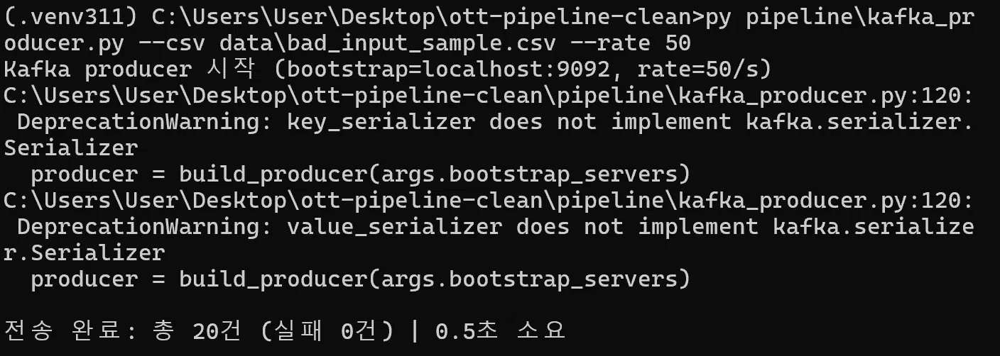

**1차 시도**: batch 41까지는 정상 처리되다가, `garbage-date`가 내부적으로
비정상 범위의 타임스탬프로 변환되면서 `write_to_postgres`에서
`datetime.fromtimestamp()` 호출 시 `OSError: [Errno 22] Invalid argument`가
발생, `StreamingQueryException`으로 전파되어 스트리밍 쿼리가 크래시했다.

```
File "spark_session_pipeline.py", line 146, in write_to_postgres
    rows = batch_df.collect()
...
OSError: [Errno 22] Invalid argument
```

**재시작 시 재크래시**: `startingOffsets=earliest` 설정 때문에 체크포인트를
지우고 재시작해도 Kafka에 남아있던 동일한 bad 레코드를 처음부터 다시 읽어
같은 지점에서 재크래시했다. `startingOffsets`를 `latest`로 변경한 뒤에야
정상적으로 재개됐다 — **잘못된 타입의 이벤트 하나가 스트리밍 쿼리 전체를
중단시킬 수 있고, 재시작 전략(offset 정책)에 따라 장애가 반복될 수 있다는
것을 확인한 부분**이다.

```sql
INSERT INTO failure_experiments (scenario, started_at, ended_at, notes)
VALUES ('invalid_input', now(), now(),
  'garbage-date 타입 오류 레코드 전송 시 event_timestamp 파싱값이 비정상 범위로
   변환되어 datetime.fromtimestamp에서 OSError(Errno 22) 발생,
   StreamingQueryException으로 전파되어 스트리밍 쿼리 크래시(batch 41 이후 종료).
   earliest offset 재시도로 동일 지점에서 재크래시 확인,
   startingOffsets를 latest로 변경 후 정상 재개')
RETURNING experiment_id;
```

#### (B) Kafka 브로커 다운 (kafka_broker_down)

500만 건 파일을 rate=500으로 전송하는 중 `docker restart ott-kafka`로
브로커를 재시작했다.

```
WARN NetworkClient: [AdminClient clientId=adminclient-1] Connection to
node 1 (localhost/127.0.0.1:9092) could not be established. Broker may
not be available.
[batch 3] 718건 세션 upsert 완료
[batch 4] 227건 세션 upsert 완료
[batch 5] 193건 세션 upsert 완료
```

연결 실패 WARN만 찍히고 스트리밍 쿼리는 **크래시하지 않고 자동 재연결**
후 batch 처리를 이어갔다. Kafka consumer의 재시도 로직이 정상 동작함을
확인했다.

#### (C) Spark 강제 종료 (spark_task_killed)

500만 건 파일 전송 중(약 15,000건 시점) 스트리밍 터미널에서 `Ctrl+C`로
강제 종료했다. 정상적으로 셧다운 훅이 실행되며 종료됐고, producer도 곧바로
`Ctrl+C`로 함께 중단했다.

#### (D) DB 적재 실패 (db_write_failure)

스트리밍을 재시작한 뒤 `docker stop ott-postgres`로 PostgreSQL을 내렸다.
워터마크가 지나 세션이 실제로 닫히는 시점(재시작 후 약 6분 뒤)에
`write_to_postgres`가 커넥션을 시도하다가 크래시했다.

```
File "spark_session_pipeline.py", line 153, in write_to_postgres
    conn = psycopg2.connect(PG_DSN)
psycopg2.OperationalError: connection to server at "localhost" (::1),
port 5432 failed: Connection refused (0x0000274D/10061)
```

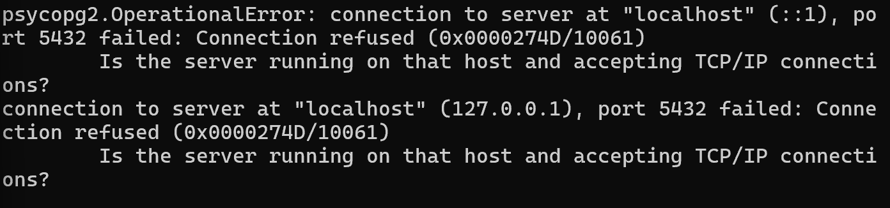

`docker start ott-postgres` 후 정상 재개를 확인했다.

#### (E) 동일 이벤트 중복 전송 (duplicate_event_replay)

5만 건 서브셋(`kafka_sample_dup_test.csv`)을 동일하게 3회 반복 전송했다.

```
전송 완료: 총 50,000건 (실패 0건) | 20.6초 소요   (1회)
전송 완료: 총 50,000건 (실패 0건) | 20.7초 소요   (2회)
전송 완료: 총 50,000건 (실패 0건) | 20.1초 소요   (3회)
```

스트리밍은 크래시 없이 정상 처리됐고(batch 15~17 upsert 성공), 중복 체크
쿼리 결과 **0행**으로 `dropDuplicates` 기반 중복 제거 로직이 정상 동작함을
확인했다.

```sql
SELECT session_id, count(*) FROM sessions
GROUP BY session_id HAVING count(*) > 1;
-- (0 rows)
```

### 8-5. 3단계 — 최종 정합성 검증

| sessions | total_events |
|---|---|
| 66,734 | 1,723,224 |

중복 세션 존재 여부(`count(*) > 1`) 재확인 결과도 **0행**으로, 장애 5종을
모두 통과한 뒤에도 세션 중복이 발생하지 않았음을 확인했다.

### 8-6. 장애 실험 결과 요약

| # | 시나리오 | 스트리밍 크래시 여부 | 비고 |
|---|---|---|---|
| 1 | baseline | - | 1,910건 → 73세션 |
| 2 | invalid_input | **크래시** | garbage-date → OSError → StreamingQueryException |
| 3 | invalid_input (재시도) | **크래시** | earliest offset으로 동일 지점 재크래시, latest로 변경 후 해결 |
| 4 | kafka_broker_down | 크래시 없음 | 자동 재연결로 정상 처리 지속 |
| 5 | spark_task_killed | (의도적 종료) | Ctrl+C 정상 셧다운 |
| 6 | db_write_failure | **크래시** | Connection refused → 재시작 후 정상화 |
| 7 | duplicate_event_replay | 크래시 없음 | 3회 중복 전송에도 세션 중복 0건 |

**배운 점**:
- 데이터 자체의 결함(잘못된 타입/포맷)은 인프라 장애(브로커 다운)보다
  스트리밍 쿼리에 더 치명적이다 — 후자는 자동 복구되지만 전자는 쿼리
  자체를 중단시킨다.
- `startingOffsets` 정책(earliest/latest)이 장애 복구 전략에 큰 영향을
  준다. earliest로 두면 문제 레코드가 Kafka에 남아있는 한 재시작해도
  같은 지점에서 반복 크래시할 수 있다.
- `dropDuplicates` 기반 세션화 로직은 중복 이벤트 재전송에 대해 안정적으로
  동작했다.

### 8-7. 아직 실행되지 않은 단계 / 남은 작업

- **전송 건수 대비 저장 건수 차이** (8-3-1 참고): 500만 건 전송했는데
  최종 `total_events`는 170만 건대로, 65.8% 차이가 난다. 세션 병합
  가설을 세워뒀지만 로그 레벨에서 확정 검증은 아직 못했다.
- 체크포인트 초기화(offset 정책 변경)가 발생한 시점 전후로 집계 수치가
  달라질 수 있다는 점을 발견했다. 다음 단계에서는 재현성을 위해 체크포인트
  디렉토리를 시나리오별로 분리하는 것을 고려 중이다.
- `quality_check`(alert 역할)가 실제로 트리거된 적이 없다 — 일부러 조건에
  안 맞는 backfill을 실행해 alert가 실제로 발동하는지 확인하는 실험이
  남아있다.
- TMDB API로 영화 메타데이터(장르, 포스터 등)를 보강하는 부분은 설계만
  해두고 실제 `sessions` 결과와 조인해서 쓰는 단계까지는 아직 못 붙였다.
- `airflow/dags/daily_batch_dag.py`(일 배치 랭킹/리텐션 재계산)는 코드는
  있으나 이번 제출에서 실제로 트리거해서 검증하지는 않았다.
- 정규화 계층/스키마 레지스트리(7장)는 아직 시작 전.
- README에는 대표 캡처만 남기고, 전체 로그는 별도 `LOAD_AND_FAULT_TEST.md`에
  정리했다.

## 9. 실행 결과 확인 방법 (Kafka·Spark·저장소·Airflow)

각 컴포넌트가 정상 동작 중인지, 지금까지 몇 건이나 처리했는지 확인하는
방법을 한곳에 정리한다.

### Kafka

```powershell
# 토픽 존재 확인
docker exec -it ott-kafka kafka-topics --bootstrap-server localhost:9092 --list

# 파티션별 최신 오프셋(=지금까지 쌓인 메시지 총량) 확인
docker exec -it ott-kafka kafka-run-class kafka.tools.GetOffsetShell --broker-list localhost:9092 --topic viewing-events

# 컨슈머 그룹 lag 확인 (그룹명은 --list로 먼저 확인)
docker exec -it ott-kafka kafka-consumer-groups --bootstrap-server localhost:9092 --list
docker exec -it ott-kafka kafka-consumer-groups --bootstrap-server localhost:9092 --describe --group <그룹명>
```

### Spark (Structured Streaming)

- 스트리밍 실행 중에는 `http://localhost:4040` (Spark UI)에서 `Structured
  Streaming` 탭으로 배치별 처리 건수·지연시간을 실시간으로 볼 수 있다.
- 터미널 로그에서 `[batch N] M건 세션 upsert 완료` 줄을 grep하면 배치별
  처리 건수를 시간순으로 확인 가능:
  ```powershell
  spark-submit ... pipeline\spark_session_pipeline.py | findstr "upsert"
  ```

### 저장소 (PostgreSQL)

```powershell
# 전체 처리 현황
docker exec -it ott-postgres psql -U ott -d ott_pipeline -P pager=off -c "SELECT count(*) AS sessions, sum(event_count) AS total_events FROM sessions;"

# 중복 여부 (정합성 검증)
docker exec -it ott-postgres psql -U ott -d ott_pipeline -P pager=off -c "SELECT session_id, count(*) FROM sessions GROUP BY session_id HAVING count(*) > 1;"

# 장애 실험 이력 전체
docker exec -it ott-postgres psql -U ott -d ott_pipeline -P pager=off -c "SELECT * FROM failure_experiments ORDER BY experiment_id;"
```

### Airflow

- 웹 UI: `http://localhost:8080` → DAG 선택 → Grid 뷰에서 태스크별 성공/실패/재시도 색상 확인
- CLI:
  ```powershell
  docker exec -it ott-airflow-scheduler airflow dags list-runs -d backfill_ingest_process_dag
  ```

## 10. 저장 결과 조회 API (FastAPI)

`sessions` 테이블에 저장된 결과를 파이프라인 밖에서 실제로 조회해볼 수
있도록 최소 기능의 read-only API(`pipeline/api.py`)를 추가했다. 대시보드나
추천 모델까지는 이번 범위에 포함하지 않고, "저장된 결과를 외부에서 조회할
수 있다"는 것 자체를 검증하는 목적이다.

### 실행

```powershell
pip install fastapi uvicorn
uvicorn pipeline.api:app --reload --port 8000
```

`http://127.0.0.1:8000/docs`에서 Swagger UI로 바로 확인 가능.

### 요청/응답 예시

Swagger UI(`/docs`)에서 직접 Execute해서 확인한 실제 응답이다.

```
GET http://127.0.0.1:8000/stats
```
```json
{
  "total_sessions": 66734,
  "total_events": 1723224,
  "avg_completion_rate": 0.948,
  "completed_sessions": 56829
}
```
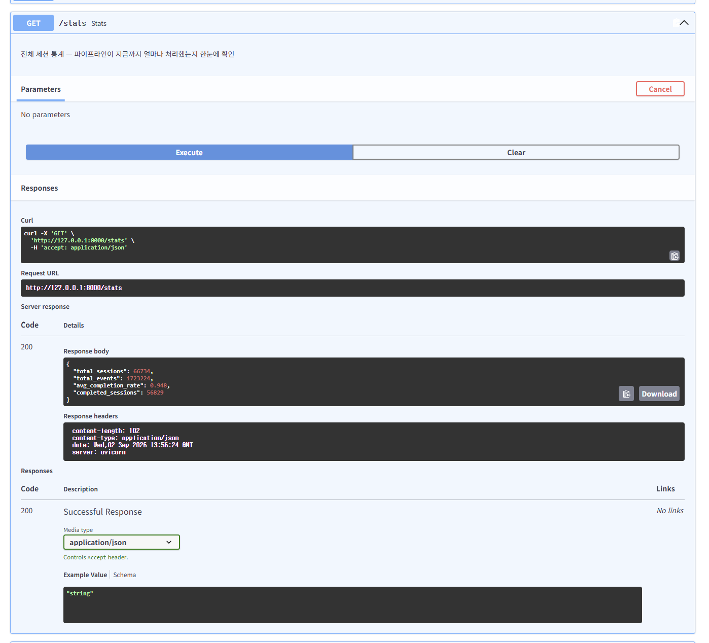

```
GET http://127.0.0.1:8000/sessions?limit=20
```
```json
[
  {
    "session_id": 1823029408626545200,
    "user_id": 8365,
    "movie_id": 471,
    "start_ts": "2009-08-13T08:48:31.577995+00:00",
    "end_ts": "2009-08-13T09:19:02.802670+00:00",
    "event_count": 20,
    "completed": true,
    "completion_rate": 1.0,
    "genre_list": ["Comedy"],
    "ingested_at": "2026-08-31T04:04:02.619852+00:00"
  }
]
```
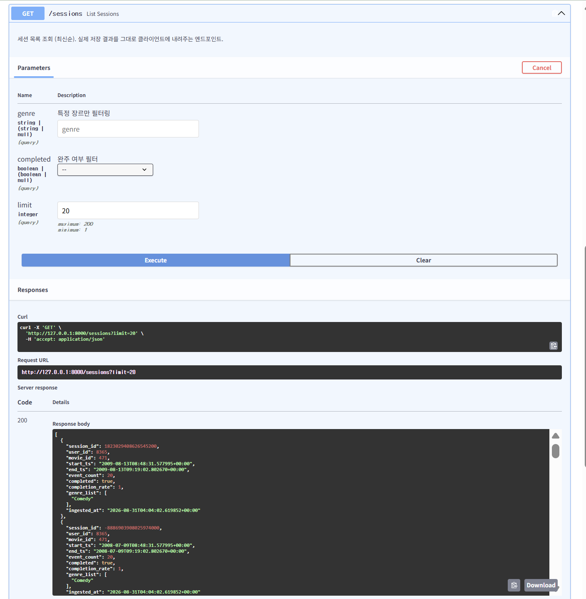

(정확한 수치는 `sessions` 테이블 현재 상태에 따라 달라진다 — 위는 실제
로컬 조회 시점 기준 응답 예시)
